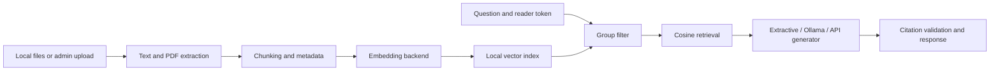

# Enterprise RAG Assistant

A small FastAPI question-answering service over **fictional, synthetic documents**. Built as a personal portfolio project to exercise document ingestion, vector retrieval, source citations, access filtering, local model options, and evaluation. It has never been used with an employer or deployed to customers.

## Why it exists

Enterprise document assistants need to show their sources, abstain when the indexed material does not answer a question, and keep restricted documents out of unauthorized retrieval. This project makes those behaviors inspectable in a compact service.

## What is implemented

- UTF-8 text, Markdown, and text-based PDF ingestion with configurable chunk size and overlap.
- Two embedding backends: deterministic **hash** vectors for immediate offline smoke tests and optional **FastEmbed** semantic embeddings.
- Exact cosine vector search in a local JSON index. This simple index is suitable for a small sample collection; a production corpus would need a proper vector database, concurrency controls, and index lifecycle management.
- Metadata filtering by access group before ranking. Reader tokens map to groups in server configuration; callers cannot select arbitrary groups.
- Cited answers in extractive mode, or JSON-constrained answers through a local Ollama model or an OpenAI-compatible chat API. Provider citations are checked against retrieved source IDs.
- Upload, question-length, file-type, and PDF-page limits; basic prompt-injection separation of instructions from document excerpts; structured errors and query latency logging.
- Tests for access filtering, ingestion controls, citation validation, refusal, and input limits.

This is a **portfolio prototype**, not a hardened enterprise authorization system. The access-token map is a demonstration only; use a real identity provider, audit logging, encryption, and threat testing before handling sensitive documents.

## Architecture



## Run locally

Python 3.11+ is required. The commands below work without an API key or model download.

```bash
git clone https://github.com/loutchianamarie/enterprise-rag-assistant.git
cd enterprise-rag-assistant
python -m venv .venv
# Linux/macOS: source .venv/bin/activate
# Windows PowerShell: .venv\Scripts\Activate.ps1
python -m pip install -e '.[dev]'
python -m rag_assistant ingest samples --reset
uvicorn rag_assistant.api:app --host 127.0.0.1 --port 8000
```

Open `http://127.0.0.1:8000/docs` for the interactive API. A sample request:

```bash
curl -s http://127.0.0.1:8000/query -H 'Content-Type: application/json' \
  -d '{"question":"How many annual leave days can employees request?"}'
```

The response includes an answer, a `citations` array with title and excerpt, `retrieved`, `latency_ms`, and `usage`. In extractive mode the answer begins `Relevant excerpt:`. An unsupported question returns `I don't know from these documents.` with an empty citation list.

### Semantic embeddings and local LLM

```bash
python -m pip install -e '.[semantic]'
export RAG_EMBEDDING_BACKEND=fastembed
python -m rag_assistant ingest samples --reset
```

The first semantic run downloads the configured model. Set `RAG_GENERATOR=ollama`, run an Ollama server locally, and set `RAG_OLLAMA_MODEL` to an installed model to generate short answers instead of excerpts. The server does not download an Ollama model for you. `RAG_GENERATOR=openai` uses `RAG_OPENAI_API_KEY` and an OpenAI-compatible `/chat/completions` endpoint. Keep the key in environment variables or an ignored `.env` file, never in Git. **Do not send private documents to an external API without authorization.**

The JSON index records which embedder built it. Re-run ingestion with `--reset` when switching backends. Hash mode is lexical and can miss paraphrases; FastEmbed is the intended semantic option.

### Docker

```bash
docker build -t enterprise-rag-assistant .
docker run --rm -p 127.0.0.1:8000:8000 enterprise-rag-assistant
```

The image includes the synthetic sample index built in hash mode. To use a semantic index, supply `RAG_EMBEDDING_BACKEND=fastembed`, mount a persistent `/app/state` volume, and run the ingestion command in that environment before starting the API. The image contains the optional semantic dependency but does not bundle downloaded model weights.

## API and access controls

| Route | Purpose |
| --- | --- |
| `GET /health` | Process and index status. |
| `POST /query` | Ask a question; optional `X-Access-Token` grants configured groups. |
| `POST /documents` | Upload a document; disabled until `RAG_ADMIN_KEY` is configured, then requires `X-Admin-Key`. |

`POST /documents` accepts multipart fields `file`, `access_group` (default `public`), `chunk_size` (100-2000), and `overlap`. The sample CLI avoids opening an upload route. A server configured with `RAG_READ_TOKENS_JSON='{"reader-secret":["public","team"]}'` can serve `team` documents to holders of that token; unauthenticated queries see `public` only. Generate real tokens outside the repository.

## Evaluation and limitations

```bash
ruff check src tests eval
python -m pytest -q
python eval/run_eval.py
```

The evaluation file contains four synthetic questions: three with expected source documents and one that should be refused. The script reports citation/refusal passes and measured request latency. It does not claim semantic quality from the hash baseline. LLM providers return input/output token counts when available; dollar cost is intentionally unreported because it depends on the chosen provider and current pricing. Additional evaluation should test paraphrases, adversarial excerpts, hallucinations despite plausible citations, language variation, and cost at scale.

PDF extraction does not include OCR. The JSON index is intentionally small-scale and has no update/delete endpoint. Citation validation confirms the model cited a retrieved chunk; it cannot prove the answer is entailed by that chunk. The prompt-injection controls are defense in depth, not a guarantee against hostile documents. No production deployment, user metrics, or accuracy claims are made.

## Repository layout

```text
src/rag_assistant/  API, ingestion, embedding, retrieval, generation
samples/            fictional documents only
eval/               synthetic questions and evaluation script
tests/              unit and API tests
.github/workflows/  CI
```

## Author

Loutchiana Marie · Personal portfolio project · [GitHub](https://github.com/loutchianamarie) · [LinkedIn](https://www.linkedin.com/in/loutchianamarie/)
